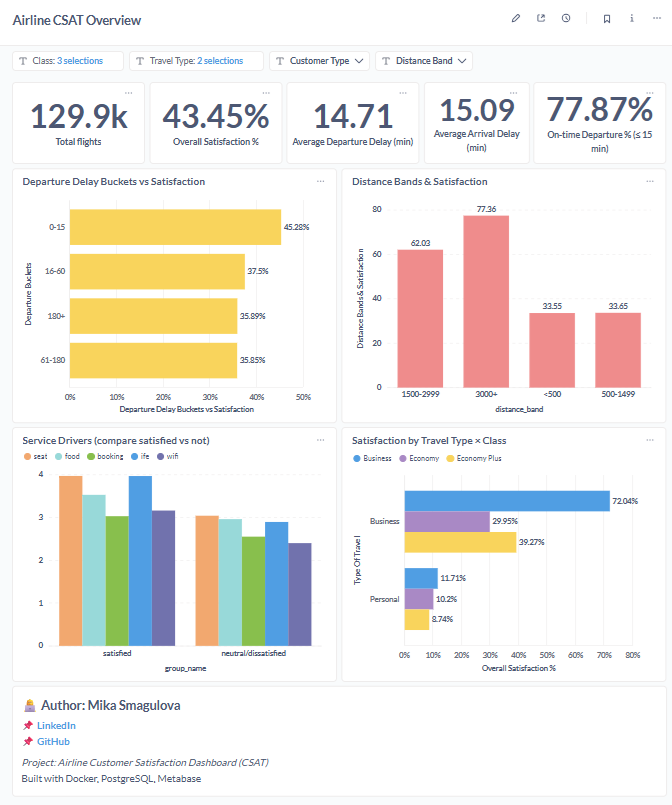

# ✈️ Metabase Project — Airline Passenger Satisfaction 
---
[]()
[]()
[](LICENSE)

## 📖 Project Overview  
This project analyzes airline passenger satisfaction using the [Airline Passenger Satisfaction dataset](https://www.kaggle.com/datasets/teejmahal20/airline-passenger-satisfaction).  
It demonstrates **end-to-end BI workflow**: data ingestion, modeling, and dashboarding — built with **Docker, PostgreSQL, Metabase, Git Bash, and VS Code**.  

The final dashboard provides KPIs and visual insights into customer satisfaction drivers, travel patterns, and operational factors.  

---

## 🛠️ Tech Stack  

- **Docker** → containerized environment for Metabase + PostgreSQL.  
- **PostgreSQL** → relational database for storing & transforming raw airline CSV data.  
- **Git Bash** → terminal used to execute Docker and psql commands.  
- **Metabase** → open-source BI tool for interactive dashboards and analysis.  
- **VS Code** → IDE for editing SQL scripts and project files.  
- **GitHub** → version control and portfolio publishing.  

---

## 📂 Data Model  

Two main tables:  

1. **`airline_raw`** → staging table (all 24 columns as text).  
   - Populated directly from the CSV file.  

2. **`airline_satisfaction`** → cleaned & typed final table.  
   - Numeric and categorical fields transformed for analysis.  
   - `is_satisfied` flag created (1 if satisfied, 0 otherwise).  

### Key Fields  

| Column | Type | Description |  
|--------|------|-------------|  
| ID | bigint | Passenger ID |  
| Gender | text | Male/Female |  
| Age | int | Passenger age |  
| Customer Type | text | First-time / Returning |  
| Type of Travel | text | Business / Personal |  
| Class | text | Business, Economy, Economy Plus |  
| Flight Distance | int | Miles flown |  
| Departure Delay | int | Delay minutes |  
| Arrival Delay | int | Delay minutes |  
| Service Ratings | int | Scores (0–5) for booking, comfort, food, wifi, etc. |  
| Satisfaction | text | "satisfied" / "neutral or dissatisfied" |  
| is_satisfied | int | 1 if satisfied, 0 otherwise (derived) |  

### Filters enabled in Metabase  

- **Class** (Business, Economy, Economy Plus)  
- **Type of Travel** (Business / Personal)  
- **Age** (numeric range)  
- **Gender**  
- **Customer Type** (First-time / Returning)  
- **Delay buckets** and **Distance bands** (derived fields)  

---

## 🗄️ SQL Setup  

### Raw Import  

```sql
CREATE TABLE airline_raw (
  col1  TEXT, col2  TEXT, ... col24 TEXT
);

\copy airline_raw FROM '/csv/airline.csv' WITH (FORMAT csv, HEADER true);
```

### Cleaned Table  

```sql
DROP TABLE IF EXISTS airline_satisfaction;

CREATE TABLE airline_satisfaction AS
SELECT
  NULLIF(col1,'')::bigint AS "ID",
  col2                    AS "Gender",
  NULLIF(col3,'')::int    AS "Age",
  col4                    AS "Customer Type",
  col5                    AS "Type of Travel",
  col6                    AS "Class",
  NULLIF(col7,'')::int    AS "Flight Distance",
  NULLIF(col8,'')::int    AS "Departure Delay",
  NULLIF(col9,'')::int    AS "Arrival Delay",
  NULLIF(col10,'')::int   AS "Departure and Arrival Time Convenience",
  NULLIF(col11,'')::int   AS "Ease of Online Booking",
  NULLIF(col12,'')::int   AS "Check-in Service",
  NULLIF(col13,'')::int   AS "Online Boarding",
  NULLIF(col14,'')::int   AS "Gate Location",
  NULLIF(col15,'')::int   AS "On-board Service",
  NULLIF(col16,'')::int   AS "Seat Comfort",
  NULLIF(col17,'')::int   AS "Leg Room Service",
  NULLIF(col18,'')::int   AS "Cleanliness",
  NULLIF(col19,'')::int   AS "Food and Drink",
  NULLIF(col20,'')::int   AS "In-flight Service",
  NULLIF(col21,'')::int   AS "In-flight Wifi Service",
  NULLIF(col22,'')::int   AS "In-flight Entertainment",
  NULLIF(col23,'')::int   AS "Baggage Handling",
  col24                   AS "Satisfaction",
  CASE WHEN lower(col24) LIKE '%satisfied%' THEN 1 ELSE 0 END AS is_satisfied
FROM airline_raw
WHERE col1 <> 'ID';
```

Add Primary Key:  
```sql
ALTER TABLE airline_satisfaction ADD PRIMARY KEY ("ID");
```

---

## 📊 Dashboard  

### KPIs (Top row)  

1. **Total Flights** → 129.9k  
2. **Overall Satisfaction %** → 43.5%  
3. **Average Departure Delay** → 14.7 min  
4. **Average Arrival Delay** → 15.1 min  
5. **On-time Departure % (≤15 min)** → 77.9%  

---

### Charts  

1. **Departure Delay Buckets vs Satisfaction** (Bar)  
2. **Distance Bands vs Satisfaction** (Column)  
3. **Service Drivers (Satisfied vs Neutral/Dissatisfied)** (Grouped Bar)  
4. **Satisfaction by Travel Type × Class** (Stacked Bar)  

---

## 📸 Results  

Screenshots and exports are stored in the [`results/`](results) folder:  

- `dashboard_overview.png` → Dashboard screenshot preview.  
- `airline_csat_dash.pdf` → Exported dashboard (PDF).  

Example preview:  



---

## 📈 Business Insights  

- **Overall CSAT is low (43%)** → major room for improvement.  
- **Delays strongly impact CSAT** → On-time performance is critical.  
- **Service quality is a differentiator** → WiFi and food & drink score poorly.  
- **Class segmentation**: Business Class drives satisfaction; Economy is at risk.  
- **Travel Type**: Business travelers are more forgiving when in Business Class, but Personal travelers in Economy have worst experiences.  

---

## 👩‍💻 Author

**Mikadataa**  
🔗 [LinkedIn](https://www.linkedin.com/in/smagulova/) | 🐙 [GitHub](https://github.com/Mikadataa)

---

## 📄 License

This project is licensed under the MIT License.
